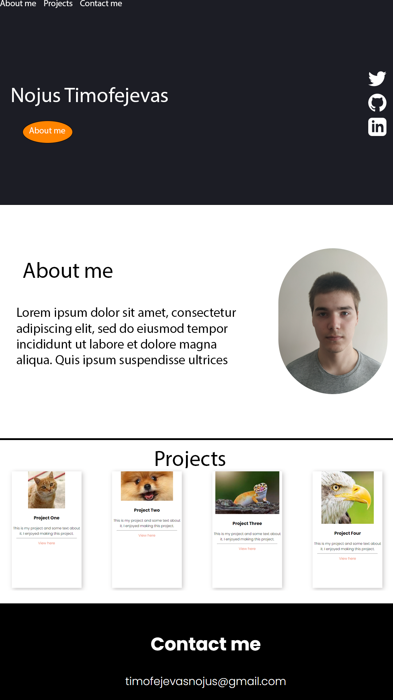
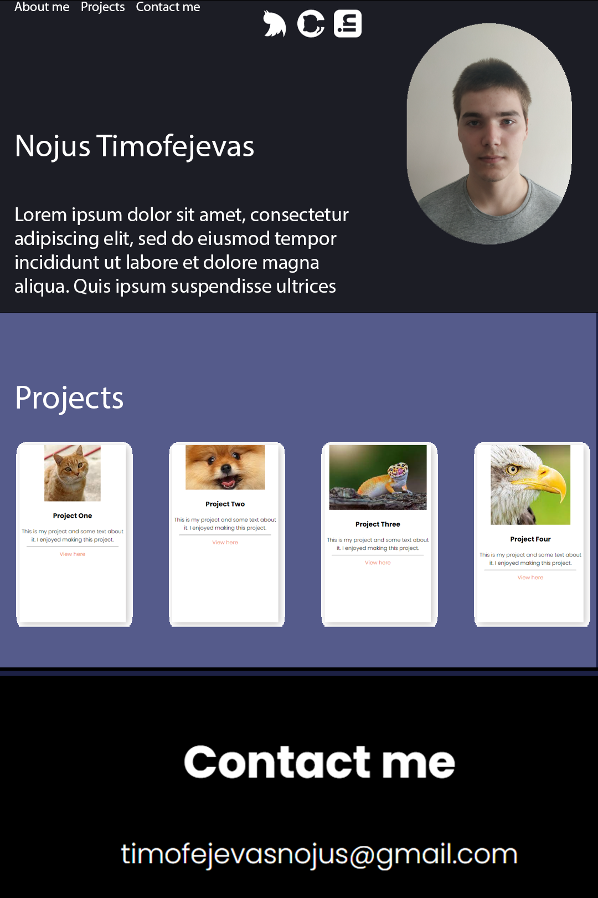

# Task 1

## 1

This Portfolio is aimed at an employer.
To hopefully persuade them to accept us to a specific position.
Hopefully the Digital Portfolio will be finished before the end of term.

## 2

* .1

* .2 

|   | About me | Contact me | Projects | Socials | Main Page |
|---|---|---|---|---|---|
| About me | &check; | &check; | &check; |  |  &check; |
| Contact me | &check; | &check; | &check;  |   | &check; |
| Projects | &check; |  &check; | &check; |   | &check; |
| Socials |  |   |   | &check; |  |
| Main page | &check; |  &check; | &check;  |   | &check; |

* .3 
https://www.youtube.com/watch?v=-D6oTPA4vXc

This design meets all requirements is tidy and looks comfortable

### Images
- Project images have been chosen at random as theres no projects i've accomplished yet

## Design one

## Design two

# Decision
I decided to keep the first design as it looks more modern and professional as well as not as compact as the second one which might overwhelm the employer/person of interest

|Testing that everything works||||||
|---|---|---|---|---|---|
| Redirects | &check; |
| hyperlinks | &check; |
| Images| &check; |
| Mobile/Scaling | &check; |
